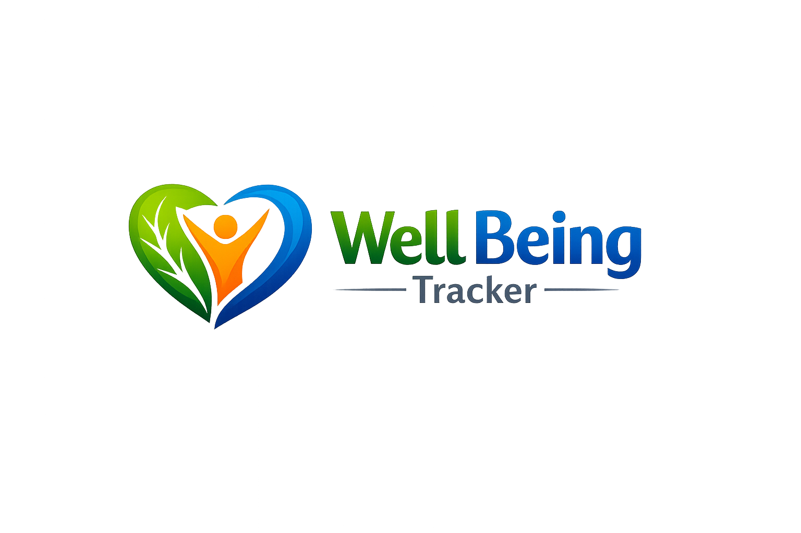

# ⚡ Digital Well-Being Tracker

<p align="center">
  
</p>

> A sleek, black-and-green wellness app to monitor your daily screen time, study vs entertainment balance, eye-care habits, and overall **Digital Balance Score**.

🌐 **Live Demo:** [https://adityabiswas-digital-well-being-tracker.onrender.com/](https://adityabiswas-digital-well-being-tracker.onrender.com/)

---

## 🌟 Features

| Feature | Description |
|---|---|
| 📊 **Dashboard** | Real-time Balance Score ring, quick stats, category doughnut chart |
| ➕ **Log Time** | Log any session by app/category/duration; quick-add presets |
| 📅 **Weekly View** | 7-day stacked bar chart + per-day Balance Score cards |
| 🌿 **Habits** | Ethical principles, daily checklist, 8 wellness tips |
| 👁️ **Eye-Care Timer** | 20-20-20 rule countdown with break logging |
| 🎯 **Balance Score** | 0–100 algorithmic score based on time, ratios, and diversity |

## 🎨 Design

- **Palette**: Midnight black (`#080d0c`) + Vivid green (`#00e676`)
- **Style**: Glassmorphism cards, animated particle background, glowing ring
- **Typography**: Inter + Space Grotesk (Google Fonts)
- **Charts**: Chart.js 4 (doughnut + stacked bar)

## 🚀 Quick Start

```bash
# 1. Clone and enter the project
git clone https://github.com/AdityaBiswas-in/AdityaBiswas-Digital-Well-Being-Tracker
cd AdityaBiswas-Digital-Well-Being-Tracker

# 2. Create virtual environment
python -m venv venv

# 3. Activate it
# Windows:
.\venv\Scripts\activate
# macOS / Linux:
source venv/bin/activate

# 4. Install dependencies
pip install -r requirements.txt

# 5. Run the app
python app.py
```

Open **http://127.0.0.1:5000** in your browser.

## 🗂️ Project Structure

```
📁 AdityaBiswas-Digital-Well-Being-Tracker/
├── app.py                  ← Flask backend + SQLite API
├── requirements.txt
├── wellbeing.db            ← Auto-created SQLite database
├── templates/
│   └── index.html          ← Single-page app template
└── static/
    ├── css/
    │   └── style.css       ← Full black & green design system
    └── js/
        └── app.js          ← Charts, timers, API calls, particles
```

## 🧠 Ethical Theme

1. **Self-Discipline** – Intentional limits on passive entertainment
2. **Mental Harmony** – Balance screen time with offline life
3. **Responsible Tech Use** – Conscious, purposeful digital engagement

## 📈 Balance Score Algorithm

| Component | Weight | Criteria |
|---|---|---|
| Screen Time | 40 pts | ≤ 6 hrs/day is ideal |
| Study Ratio | 30 pts | 40–60% study is optimal |
| Entertainment | 20 pts | < 30% entertainment |
| Diversity | 10 pts | Using multiple categories |

---

*Built with Flask · SQLite · Chart.js · Vanilla CSS/JS*